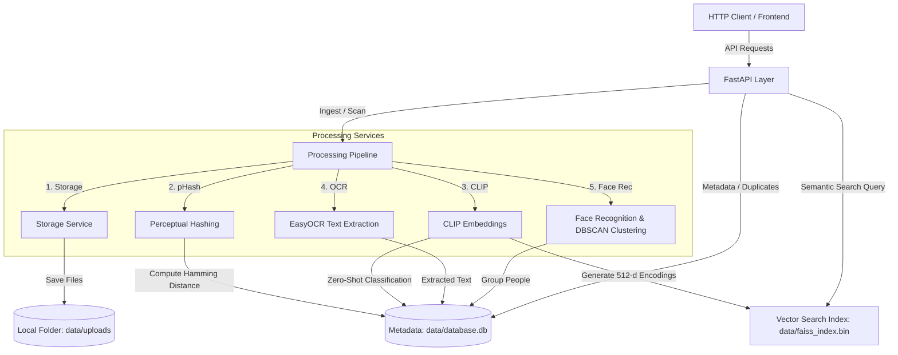

# PhotoMind AI

PhotoMind AI is a powerful, locally deployable, AI-powered photo management platform. It ingests your image collections, detects near/exact duplicates, extracts text using OCR, groups photos by detected faces (people), and provides natural language semantic query capabilities.

---

## Architecture Overview



---

## Features

1. **Semantic Search:** Search your photos with natural queries (e.g. *"black cat sitting in the garden"*) using CLIP embeddings and FAISS index search.
2. **Duplicate Detection:** Find exact and near-duplicates automatically utilizing Perceptual Hashing (pHash).
3. **OCR (Optical Character Recognition):** Scan documents, receipts, and images with embedded text automatically using EasyOCR.
4. **Face Clustering (People Grouping):** Automatically detect faces, compute 128-dimensional biometric embeddings, and group them into people clusters using DBSCAN.
5. **Zero-Shot Categorization:** Automatically sort photos into classes like `Landscape/Nature`, `Document/Receipt`, `Portrait/People`, `Animal/Pet`, and `Other` using CLIP classification.

---

## Tech Stack

- **Framework:** FastAPI (Python 3.10)
- **Database:** SQLite & SQLAlchemy
- **Vector Index:** FAISS (faiss-cpu)
- **Deep Learning Embeddings:** OpenAI CLIP (via Hugging Face Transformers)
- **OCR Engine:** EasyOCR (PyTorch backend)
- **Biometric Detection:** face_recognition (wrapping dlib)
- **Clustering Algorithm:** DBSCAN (scikit-learn)

---

## Getting Started

### Prerequisites
- Docker & Docker Compose **OR**
- Python 3.10+ with `cmake` and a C++ compiler installed (for compiling `dlib` locally)

---

### Option A: Running with Docker (Recommended)
Docker containers build all native dependencies (including CMake, gcc, and dlib compilation) out of the box.

1. **Clone/Move into the workspace:**
   ```bash
   cd "/Users/keshavgoyal/Desktop/Ai -photo detector"
   ```

2. **Start the containers using docker-compose:**
   ```bash
   docker compose up -d --build
   ```

3. **Verify API is running:**
   Visit `http://localhost:8000/` or query:
   ```bash
   curl http://localhost:8000/
   ```

---

### Option B: Local Installation

1. **Install System Dependencies (For MacOS/Homebrew):**
   ```bash
   brew install cmake pkg-config
   ```

2. **Create and Activate a Virtual Environment:**
   ```bash
   python -m venv venv
   source venv/bin/activate
   ```

3. **Install Dependencies:**
   ```bash
   pip install --upgrade pip
   pip install -r requirements.txt
   ```

4. **Run Server Local:**
   ```bash
   uvicorn app.main:app --reload --port 8000
   ```

---

## API Reference

### 1. Photo Upload
- **Endpoint:** `POST /api/photos/upload`
- **Content-Type:** `multipart/form-data`
- **Request Parameters:**
  - `file`: Image file (JPG, PNG, WEBP, BMP)
- **Response:**
  ```json
  {
    "id": 1,
    "filename": "my_cat.jpg",
    "filepath": "data/uploads/1c52119b-c4f4-411a-ab6a.jpg",
    "phash": "a5d896131c9a0c4f",
    "ocr_text": null,
    "category": "Animal/Pet",
    "width": 1024,
    "height": 768,
    "file_size": 142084,
    "created_at": "2026-06-13T17:40:00",
    "faces": []
  }
  ```

### 2. Folder Scanning
- **Endpoint:** `POST /api/photos/scan-folder`
- **Content-Type:** `application/json`
- **Request Body:**
  ```json
  {
    "directory_path": "/absolute/path/to/my/local/photos"
  }
  ```
- **Response:**
  ```json
  {
    "status": "processing",
    "message": "Scan initialized in the background. Found 45 images to process.",
    "scanned_path": "/absolute/path/to/my/local/photos",
    "photos_found": 45,
    "photos_processed": 0
  }
  ```

### 3. Natural Language Search
- **Endpoint:** `GET /api/search`
- **Parameters:**
  - `q`: Search query string (e.g. `cat sitting on grass`)
  - `type`: Search method: `semantic` (default), `ocr`, or `combined`
  - `limit`: Max results (default `10`)
- **Response:**
  ```json
  [
    {
      "photo": {
        "id": 1,
        "filename": "my_cat.jpg",
        "filepath": "data/uploads/1c52119b-c4f4-411a-ab6a.jpg",
        "phash": "a5d896131c9a0c4f",
        "ocr_text": null,
        "category": "Animal/Pet",
        "width": 1024,
        "height": 768,
        "file_size": 142084,
        "created_at": "2026-06-13T17:40:00",
        "faces": []
      },
      "similarity": 0.7842
    }
  ]
  ```

### 4. Duplicate Detection
- **Endpoint:** `GET /api/duplicates`
- **Parameters:**
  - `threshold`: Optional Hamming distance threshold override (default: `10`)
- **Response:**
  ```json
  [
    {
      "phash": "a5d896131c9a0c4f",
      "photos": [
        { "id": 1, "filename": "original_cat.jpg", "filepath": "data/uploads/...jpg" },
        { "id": 5, "filename": "copy_cat_resized.jpg", "filepath": "data/uploads/...jpg" }
      ]
    }
  ]
  ```

### 5. Categories Grouping
- **Endpoint:** `GET /api/categories`
- **Response:**
  ```json
  [
    {
      "category": "Animal/Pet",
      "photos": [
        { "id": 1, "filename": "my_cat.jpg", "filepath": "data/uploads/1c52119b-c4f4-411a-ab6a.jpg" }
      ]
    },
    {
      "category": "Document/Receipt",
      "photos": [
        { "id": 2, "filename": "invoice_123.png", "filepath": "data/uploads/7a52119b-a3d2.png" }
      ]
    }
  ]
  ```

### 6. Face Groups (People)
- **Endpoint:** `GET /api/faces/groups`
- **Response:**
  ```json
  [
    {
      "id": 1,
      "name": "Person 1",
      "created_at": "2026-06-13T17:42:00",
      "faces": [
        {
          "id": 1,
          "photo_id": 3,
          "box_top": 120,
          "box_right": 250,
          "box_bottom": 240,
          "box_left": 130,
          "cluster_id": 1
        }
      ]
    }
  ]
  ```

### 7. Rename Face Group
- **Endpoint:** `PUT /api/faces/groups/{id}`
- **Request Body:**
  ```json
  {
    "name": "Jane Doe"
  }
  ```
- **Response:**
  ```json
  {
    "id": 1,
    "name": "Jane Doe",
    "created_at": "2026-06-13T17:42:00",
    "faces": [
      {
        "id": 1,
        "photo_id": 3,
        "box_top": 120,
        "box_right": 250,
        "box_bottom": 240,
        "box_left": 130,
        "cluster_id": 1
      }
    ]
  }
  ```

---

## Running Automated Tests

To run the Pytest verification suite:
```bash
pytest -v
```
